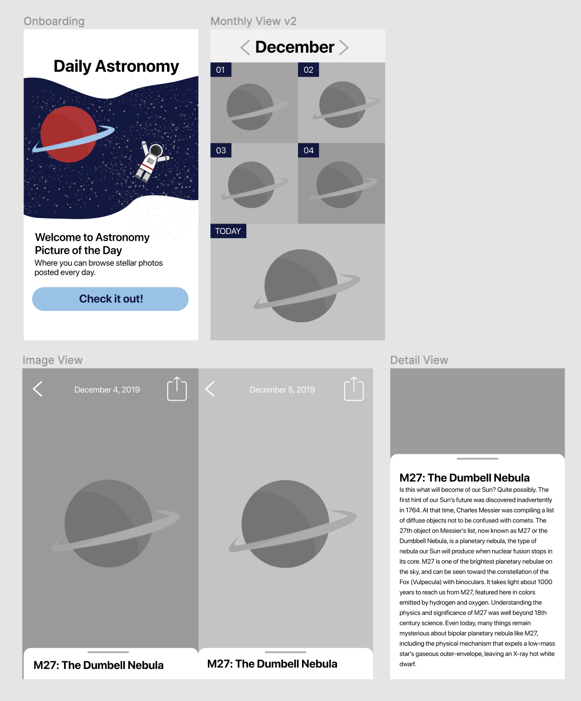

# Astronomy Picture of the Day

## Introduction

For this project, you'll build an app to view the [Astronomy Picture of the Day](https://apod.nasa.gov/apod/astropix.html).

You will build the app primarily in Objective-C with some Swift components. The goal of this project is to practice using Swift and Objective-C together, including using features like nullability, lightweight generics, and name customization.

## Instructions

Fork and clone this repository. Create your own Xcode project. Commit regularly as you complete the requirements in this project.

The instructions for this project are intentionally sparse. At this point in the course, you are familiar with most of the concepts used in building an app like this, and should be able to implement it with minimal guidance. This also means that you have the freedom to implement most parts of the app as you see fit. However, please make sure you follow the instructions that are here.

## Register an API Key

Create an API key at: <https://api.nasa.gov/>

Sample request JSON: <https://api.nasa.gov/planetary/apod?api_key=DEMO_KEY>

## Implement the app using the Figma Design

[Leah Kramer](https://www.leahadrianakramer.com) designed the APOD app.

Use her design as a starting point.

1. Collection View with photos of the day (make all cells the same size and color to start)
2. Detail view with model popup
3. Use any of the assets in the Design folder

## Technical Requirements 

1. No Cocoapods or 3rd party frameworks - do everything yourself.
2. Your model must be in Objective-C — use any language for your other code files.
3. Set your App Icon and App Name so it doesn't clip on the Home screen.
4. A PDF is a vector that can scale to any size.

## Go Further

1. Make the collection view use different sized cells to feature today (similar to Pinterest)
2. Tap to hide UI on the Details View to see photo
3. Double-tap to zoom in (Use a UIScrollView with zoom)
4. Alternate placeholder color
5. Add day tags to your collection view cell
